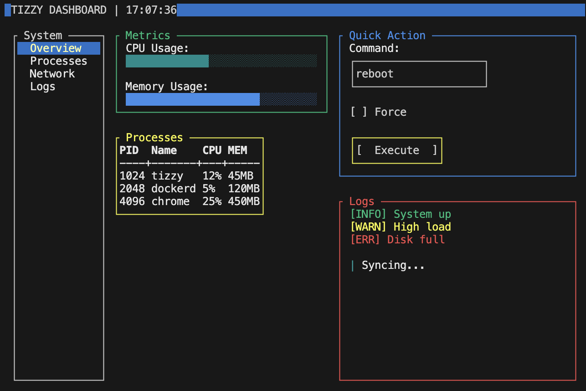
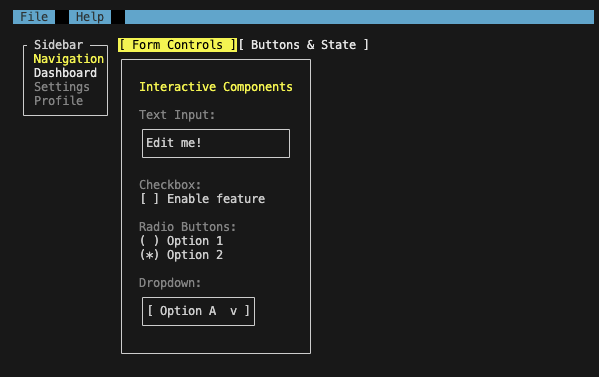
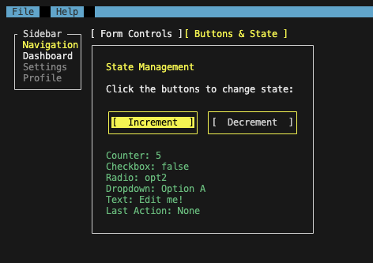
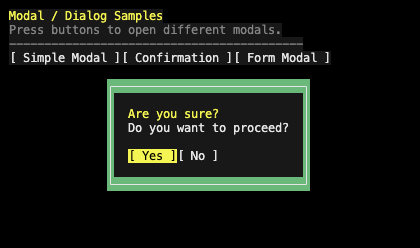
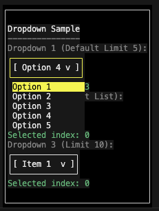

# Tizzy

A declarative Terminal User Interface (TUI) library for Go, inspired by React's component model and CSS Flexbox layout.



## Features

- **Declarative UI**: Build UIs by composing components that return a virtual tree of nodes.
- **Flexbox Layout**: Easy alignment and distribution of space with `row` and `column` directions, `JustifyContent`, and `FillWidth`/`FillHeight`.
- **React-like Hooks**: `UseState` and `UseEffect` for local state and lifecycle effects, keeping logic close to where it is used.
- **Animation System**: `UseAnimation`, `UseTween`, and `UseTweenColor` hooks backed by a single shared scheduler — no per-component goroutines or tickers.
- **Rich Interactions**: Focus management, keyboard navigation, and mouse support.
- **Overlays & Portals**: Modals, dropdowns, and custom positioned popups rendered above the main tree.
- **Extensible**: Easy to create custom components by implementing one or more narrow interfaces.

## How it Compares to Alternatives

Tizzy takes a different approach compared to other popular Go TUI libraries. While [Bubbletea](https://github.com/charmbracelet/bubbletea) relies on the Elm Architecture (Model-Update-View) and [tview](https://github.com/rivo/tview) uses a more traditional widget hierarchy, Tizzy brings a **declarative, React-like component model** to Go TUIs. It features React-inspired hooks (like `UseState` and `UseEffect`) for local state management and a layout system heavily inspired by CSS Flexbox. This makes it highly intuitive for developers coming from modern web frameworks.

## Screenshots

### Kitchen Sink
Showing various form controls and state management.




### Overlays & Dialogs
Showing modals and dropdowns.




## Quick Start

Here is a minimal example of a counter application:

```go
package main

import (
    "log"
    "strconv"
    "github.com/pavelgj/tizzy-go/tz"
)

func main() {
    app, err := tz.NewApp()
    if err != nil {
        log.Fatal(err)
    }

    render := func(ctx *tz.RenderContext) tz.Node {
        count, setCount := tz.UseState(ctx, 0)

        return tz.NewBox(
            tz.Style{
                Border:        true,
                Padding:       tz.Padding{Top: 1, Bottom: 1, Left: 2, Right: 2},
                FlexDirection: "column",
            },
            tz.NewText(tz.Style{}, "Clicks: "+strconv.Itoa(count)),
            tz.NewButton(tz.Style{Focusable: true, ID: "btn-increment"}, "Increment", func() {
                setCount(count + 1)
            }),
        )
    }

    if err := app.Run(render, nil); err != nil {
        log.Fatal(err)
    }
}
```

## Core Concepts

### Components

Every component implements the `Node` interface (`GetStyle() Style`) and optionally implements additional interfaces for layout, rendering, event handling, focus, and overlays. The framework detects capabilities at runtime — a component only needs to implement what it actually uses.

Tizzy supports two authoring patterns:

1. **Functional Components**: Pure functions that take props and return a `Node`. Best for stateless or read-only UI.
2. **Stateful Components**: Constructor functions that call `UseState`/`UseEffect` hooks and return a `Node`. Best for interactive components that own internal state.

### Layout

Layout is handled by the `Box` component using a Flexbox-style system.

- `FlexDirection`: `"row"` or `"column"`.
- `FillWidth` / `FillHeight`: Fill available space.
- `JustifyContent`: `"flex-start"`, `"center"`, `"flex-end"`.

## Styling

All components take a `Style` struct to define their appearance and layout.

### Style Properties

- `ID` (`string`): Unique identifier for the component. Required for stateful hooks and focus management.
- `Focusable` (`bool`): If true, the component can receive focus.
- `Multiline` (`bool`): For text components, allows text to wrap.
- `Width` (`int`): Fixed width in cells.
- `Height` (`int`): Fixed height in cells.
- `MaxHeight` (`int`): Maximum height in cells.
- `FlexDirection` (`string`): `"row"` or `"column"` (default). Used by `Box`.
- `JustifyContent` (`string`): `"flex-start"`, `"center"`, `"flex-end"`. Used by `Box`.
- `Border` (`bool`): If true, draws a border around the component.
- `Padding` (`Padding`): Inward spacing.
- `Margin` (`Margin`): Outward spacing.
- `Color` (`tcell.Color`): Foreground color.
- `Background` (`tcell.Color`): Background color.
- `FocusColor` (`tcell.Color`): Foreground color when focused. Falls back to yellow if not set.
- `FocusBackground` (`tcell.Color`): Background color when focused.
- `TextAttrs` (`tcell.AttrMask`): Terminal text attributes — bold, italic, underline, etc. — expressed as a bitmask. Combine `tcell` constants directly or populate this field via the `tzlipgloss` adapter (see below). Example: `tcell.AttrBold | tcell.AttrUnderline`.
- `FillWidth` (`bool`): If true, fills available width.
- `FillHeight` (`bool`): If true, fills available height.
- `GridRow`, `GridCol`, `GridRowSpan`, `GridColSpan` (`int`): Used by `GridBox` layout.

## Hooks and Lifecycle

Tizzy supports React-like hooks for state management, lifecycle effects, and animations inside the render function.

> [!NOTE]
> Hooks rely on call order to identify state across renders. Do not call hooks inside loops or conditions.

### UseState

Allows components to have local state that persists across renders. Tizzy provides a generic wrapper for type safety.

```go
count, setCount := tz.UseState(ctx, 0) // T inferred as int
setCount(count + 1)                     // triggers a re-render
```

### UseEffect

Performs side effects when a component mounts and cleans up when it unmounts.

```go
ctx.UseEffect(func() func() {
    ticker := time.NewTicker(500 * time.Millisecond)
    go func() { /* ... */ }()
    return func() { ticker.Stop() } // cleanup on unmount
})
```

### UseAnimation

Returns a progress value in `[0.0, 1.0]` that advances over the given duration using the chosen easing function. Backed by a single shared scheduler — no goroutine is created per call.

```go
// Animate from 0 → 1 on mount
progress := tz.UseAnimation(ctx, 400*time.Millisecond, tz.EaseOut)
width := int(progress * 40)

// Loop indefinitely (e.g. for a custom spinner)
progress := tz.UseAnimation(ctx, 600*time.Millisecond, tz.Linear, tz.WithLoop())

// Trigger manually from an event handler
progress, trigger := tz.UseAnimation(ctx, 300*time.Millisecond, tz.EaseOut,
    tz.WithManualTrigger())
// call trigger() from a button's onPress or HandleEvent
```

**Built-in easing functions**: `tz.Linear`, `tz.EaseIn`, `tz.EaseOut`, `tz.EaseInOut`.

### UseTween

Smoothly interpolates a typed value toward a target whenever the target changes — equivalent to a CSS `transition`. When the target changes mid-animation, the tween picks up from the current value.

```go
// Animate a panel width open/closed
targetW := 0
if open { targetW = 40 }
w := tz.UseTween(ctx, targetW, 200*time.Millisecond, tz.EaseOut)
// w is an int that smoothly follows targetW

// Works with float64 too
opacity := tz.UseTween(ctx, targetOpacity, 300*time.Millisecond, tz.EaseInOut)
```

### UseTweenColor

Smoothly interpolates between two RGB colors.

```go
target := tcell.NewRGBColor(40, 40, 40)
if focused {
    target = tcell.NewRGBColor(0, 120, 215)
}
borderColor := tz.UseTweenColor(ctx, target, 120*time.Millisecond, tz.EaseOut)
```

> [!NOTE]
> `UseTweenColor` requires RGB colors created with `tcell.NewRGBColor`. Named palette colors (e.g. `tcell.ColorBlue`) are not interpolatable and fall back to showing the target immediately.

## Components Reference

### Containers & Layout

#### Box

The fundamental layout container.

```go
tz.NewBox(
    tz.Style{FlexDirection: "row"},
    child1,
    child2,
)
```

#### ScrollView

A container that allows scrolling its content if it exceeds available size.

```go
tz.NewScrollView(ctx, tz.Style{Height: 10}, largeContentNode)
```

#### Modal

A centered overlay that traps focus. Returns `nil` when closed (safe to include in `NewBox` children unconditionally).

```go
tz.NewModal(ctx, tz.Style{Background: tcell.ColorBlue}, modalContentNode, isOpen)
```

#### Popup

A floating overlay anchored to an explicit screen position. Returns `nil` when closed.

```go
tz.NewPopup(ctx,
    tz.Style{Border: true, Background: tcell.ColorGray},
    popupContentNode,
    x, y,   // absolute screen position
    isOpen,
)
```

### Basic Components

#### Text

Displays static text.

```go
tz.NewText(tz.Style{Color: tcell.ColorGreen}, "Hello World")
```

#### ANSIText

Renders a string that contains ANSI SGR escape sequences — for example the output of `lipgloss.Render()` or `glamour.Render()` — inside the Tizzy layout tree. The string is parsed once at construction time; each visible rune is written to the grid with its embedded style.

```go
// Inline ANSI escape sequences
tz.NewANSIText(tz.Style{}, "\x1b[1;31mError:\x1b[0m something went wrong")

// Output of lipgloss.Render embedded as-is
bold := lipgloss.NewStyle().Bold(true).Foreground(lipgloss.Color("#FF71EF"))
tz.NewANSIText(tz.Style{}, bold.Render("Lip Gloss"))

// Glamour markdown in a scroll view
rendered, _ := glamour.Render(markdownSource, "dark")
tz.NewScrollView(ctx, tz.Style{FillWidth: true, FillHeight: true},
    tz.NewANSIText(tz.Style{}, rendered),
)
```

Supported ANSI sequences: basic foreground/background colors (30–37, 40–47), bright variants (90–97, 100–107), 256-color palette (`38;5;n` / `48;5;n`), true-color RGB (`38;2;r;g;b` / `48;2;r;g;b`), and text attributes bold, dim, italic, underline, blink, reverse, strikethrough. OSC sequences (e.g. hyperlinks) and non-SGR CSI sequences are skipped cleanly.

Layout properties on the wrapping `tz.Style` (`Width`, `Padding`, `Margin`) work exactly as with `NewText`.

#### Button

A clickable button.

```go
tz.NewButton(tz.Style{Focusable: true, ID: "my-button"}, "Click Me", func() {
    // handle click
})
```

#### TextInput

A single-line text input field.

```go
tz.NewTextInput(ctx, tz.Style{Focusable: true}, "initial value", func(newValue string) {
    // handle change
})
```

### Selection Components

#### List

Displays a list of selectable items.

```go
tz.NewList(
    ctx,
    tz.Style{Focusable: true},
    "state-key",       // resets cursor/scroll when changed
    items,             // []any
    0,                 // initial selected index (-1 for none)
    func(item any, index int, selected bool, cursor bool) tz.Node {
        return tz.NewListItem(item.(string), selected, cursor)
    },
    func(idx int) { /* handle selection */ },
)
```

Options on the returned `*List` struct:

- `OnSelectionChange func(int)`: Called when the cursor moves.
- `OnFocus func(state *ListState)`: Called when the list gains focus.

#### Checkbox

A toggleable checkbox.

```go
tz.NewCheckbox(ctx, tz.Style{Focusable: true}, "Enable Feature", true, func(checked bool) {
    // handle change
})
```

#### RadioButton

A mutually exclusive selection button.

```go
tz.NewRadioButton(ctx, tz.Style{Focusable: true}, "Option 1", "value1", isSelected, func(value string) {
    // handle selection
})
```

#### Dropdown

A dropdown menu for selecting from a list.

```go
tz.NewDropdown(
    ctx,
    tz.Style{Focusable: true},
    []string{"Option A", "Option B", "Option C"},
    selectedIndex,
    func(idx int) { /* handle selection */ },
)
```

### Navigation

#### Tabs

A tabbed interface for switching between views. Use `←` / `→` (when focused) or click a tab header to switch.

```go
tz.NewTabs(
    ctx,
    tz.Style{ID: "tabs", Focusable: true},
    []tz.Tab{
        {Label: "Home",     Content: homeNode},
        {Label: "Settings", Content: settingsNode},
    },
)
```

#### MenuBar

A top-level menu bar with keyboard navigation and Alt-key shortcuts.

```go
tz.NewMenuBar(
    ctx,
    tz.Style{Focusable: true},
    []tz.Menu{
        {
            Title:   "File",
            AltRune: 'f',
            Items: []tz.MenuItem{
                {Label: "New",  Action: func() {}},
                {Label: "Exit", Action: func() {}},
            },
        },
    },
)
```

### Feedback & Data

#### ProgressBar

A horizontal progress bar.

```go
tz.NewProgressBar(tz.Style{Width: 40, Color: tcell.ColorGreen}, 0.75) // 75%
```

#### Spinner

An animated loading spinner, driven by the shared animation scheduler.

```go
// Default frames (|/-\) at 100ms per frame
tz.NewSpinner(ctx, tz.Style{Color: tcell.ColorYellow})

// Custom frames and speed
tz.NewSpinnerCustom(ctx, tz.Style{Color: tcell.ColorGreen},
    []string{"⠋", "⠙", "⠹", "⠸", "⠼", "⠴", "⠦", "⠧", "⠇", "⠏"},
    60*time.Millisecond,
)
```

#### Table

A grid table for displaying tabular data.

```go
tz.NewTable(
    tz.Style{},
    []string{"Name", "Age", "Role"},
    [][]string{
        {"Alice", "30", "Dev"},
        {"Bob",   "25", "Designer"},
    },
)
```

## Lipgloss Integration

Tizzy provides two opt-in integration points with the [Charmbracelet Lipgloss](https://github.com/charmbracelet/lipgloss) styling library. Neither requires changes to code that doesn't use them.

### `ANSIText` — embed Lipgloss-rendered content

`tz.NewANSIText` (in the core `tz` package, no Lipgloss dependency) renders any ANSI-escaped string inside the layout tree. Pass `lipgloss.Render()` output directly:

```go
import "github.com/charmbracelet/lipgloss"

badge := lipgloss.NewStyle().
    Bold(true).
    Foreground(lipgloss.Color("#FFFFFF")).
    Background(lipgloss.Color("#7C3AED")).
    Padding(0, 1).
    Render("NEW")

tz.NewANSIText(tz.Style{}, badge)
```

This is also the right approach for [Glamour](https://github.com/charmbracelet/glamour) markdown output:

```go
import "github.com/charmbracelet/glamour"

rendered, _ := glamour.Render(markdownSource, "dark")
tz.NewScrollView(ctx, tz.Style{FillWidth: true, FillHeight: true},
    tz.NewANSIText(tz.Style{}, rendered),
)
```

### `tzlipgloss` — reuse Lipgloss design tokens on Tizzy components

The optional `tzlipgloss` sub-package converts a `lipgloss.Style` into a `tz.Style` so that a shared color/typography system drives both Lipgloss-rendered content and Tizzy-native components without duplication.

```bash
go get github.com/pavelgj/tizzy-go/tzlipgloss
```

```go
import (
    "github.com/charmbracelet/lipgloss"
    "github.com/pavelgj/tizzy-go/tzlipgloss"
)

// Define tokens once with Lipgloss…
var primary = lipgloss.NewStyle().Bold(true).Foreground(lipgloss.Color("#7C3AED"))
var muted   = lipgloss.NewStyle().Faint(true).Foreground(lipgloss.Color("#6B7280"))

// …use them on Tizzy-native components via the adapter.
tz.NewText(tzlipgloss.Style(primary), "Dashboard")
tz.NewText(tzlipgloss.Style(muted),   "Last updated: just now")

// Color conversion is also available standalone.
tz.Style{Color: tzlipgloss.Color(lipgloss.Color("#FF71EF"))}
```

**What is mapped:** foreground color, background color, bold, italic, underline, strikethrough, blink, dim, reverse.

**What is not mapped:** padding, margin, border, width, height, alignment — express those via `tz.Style` directly, since Tizzy owns the layout pass.

## Samples

The `samples/` directory contains runnable examples for every major feature:

| Sample | Description |
|--------|-------------|
| `ansitext` | `NewANSIText` — basic/256/true-color swatches, text attributes, inline mixed styles in a scroll view |
| `lipgloss` | `tzlipgloss.Style()` adapter + `NewANSIText` with `lipgloss.Render()` output; tabbed demo |
| `animation` | `UseAnimation`, `UseTween`, easing curves, flash & slide transitions |
| `spinner` | `NewSpinner` and `NewSpinnerCustom` with various frame sets |
| `tabs` | `NewTabs` with interactive content per tab |
| `dashboard` | Multi-panel layout with live data |
| `kitchensink` | All form controls in one screen |
| `menubar` | Full menu bar with submenus |
| `modal` | Modal overlays and focus trapping |
| `dropdown` | Dropdown selection component |
| `progressbar` | Progress bar display |
| `scrollview` | Scrollable content containers |
| `table` | Tabular data display |
| `grid` | Grid layout system |
| `flexbox` | Flexbox alignment options |

Run any sample with:

```bash
go run ./samples/animation
```

## Installation

```bash
go get github.com/pavelgj/tizzy-go
```

## Further Reading

- [Architecture & Internals](docs/architecture.md) — render pipeline, Portal mechanism, overlay model, interface catalogue
- [Creating New Components](docs/new-component.md) — step-by-step guide with layout, render, event, and overlay examples
- [Lipgloss Integration](docs/lipgloss.md) — design rationale, `ANSIText` implementation notes, `tzlipgloss` adapter API reference
- [Contributing](CONTRIBUTING.md) — visual regression testing workflow
